# 🔄 Алгоритм подбора термошкафа

> **Блок-схема процесса конфигурации термошкафа**  
> Пошаговый выбор параметров оборудования

---

## 📊 Основная диаграмма

```mermaid
flowchart TD
    subgraph UI["🖥️ Пользовательский интерфейс"]
        START([Начало сборки термошкафа])
        Q1[Вопрос: Укажите потребляемую<br/>мощность оборудования]
        Q2[Вопрос: Укажите количество и<br/>характеристики автоматических<br/>выключателей]
        ADD_BREAKER{Добавить ещё<br/>автомат?}
        Q3[Вопрос: Укажите количество и<br/>тип точек подключения]
        ADD_SOCKET{Добавить ещё<br/>точку?}
        Q4[Вопрос: Требуется обогрев?]
        Q5[Вопрос: Требуется вентиляция<br/>охлаждение?]
        Q6[Вопрос: Выберите степень IP]
        Q7[Вопрос: Требуется установка<br/>коммутационной панели?]
        Q8[Вопрос: Выберите размер шкафа]
        FINISH([Готовый шкаф])
    end
    
    subgraph LOGIC["⚙️ Внутренняя логика конфигуратора"]
        SEL_POWER[Селектор мощности:<br/>• от 0 до 100W<br/>• от 101 до 1000W<br/>• от 1001 до 5000W]
        SEL_BREAKER[Селектор автомата:<br/>• Тип: C6, C10, C16, C25, C32<br/>• Количество: 1-20]
        STORE_BREAKERS[(Массив автоматов<br/>breakersList)]
        SEL_SOCKET[Селектор точек:<br/>• Тип: Розетка / Клемма<br/>• Количество: 1-10]
        STORE_SOCKETS[(Массив точек<br/>socketsList)]
        SEL_HEATER[Селектор обогревателя:<br/>• Мощность: 100W, 200W, 500W<br/>• Модель: HTR-100, HTR-200]
        SEL_VENT[Селектор вентилятора:<br/>• Тип: осевой, центробежный<br/>• Производительность: м³/ч]
        SEL_IP[Селектор IP:<br/>• IP54<br/>• IP56<br/>• IP65 если нет вентиляции]
        VALIDATE_IP[Валидация:<br/>IP65 + вентиляция = конфликт]
        SEL_COMM[Селектор коммутации:<br/>• Оптика: тип адаптеров, кол-во<br/>• Медь: кол-во адаптеров]
        SEL_SIZE[Селектор размера:<br/>• Габариты: ШxГxВ<br/>• Свободное место на DIN-рейках мм]
        CALC[Расчёты:<br/>• Суммарная мощность<br/>• Требуемая вентиляция<br/>• Вес оборудования]
        CONFIG[(Финальная конфигурация<br/>JSON)]
    end
    
    START --> Q1
    Q1 -.->|Выбор пользователя| SEL_POWER
    SEL_POWER -.->|Сохранить| Q2
    
    Q2 -.->|Выбор пользователя| SEL_BREAKER
    SEL_BREAKER -->|Добавить в массив| STORE_BREAKERS
    STORE_BREAKERS -.-> ADD_BREAKER
    ADD_BREAKER -->|Да| Q2
    ADD_BREAKER -->|Нет| Q3
    
    Q3 -.->|Выбор пользователя| SEL_SOCKET
    SEL_SOCKET -->|Добавить в массив| STORE_SOCKETS
    STORE_SOCKETS -.-> ADD_SOCKET
    ADD_SOCKET -->|Да| Q3
    ADD_SOCKET -->|Нет| Q4
    
    Q4 -.->|Да| SEL_HEATER
    Q4 -->|Нет| Q5
    SEL_HEATER -.-> Q5
    
    Q5 -.->|Да| SEL_VENT
    Q5 -->|Нет| Q6
    SEL_VENT -.-> Q6
    
    Q6 -.->|Выбор пользователя| SEL_IP
    SEL_IP --> VALIDATE_IP
    VALIDATE_IP -.->|Конфликт| Q5
    VALIDATE_IP -->|OK| Q7
    
    Q7 -.->|Да| SEL_COMM
    Q7 -->|Нет| Q8
    SEL_COMM -.-> Q8
    
    Q8 -.->|Выбор пользователя| SEL_SIZE
    SEL_SIZE --> CALC
    CALC --> CONFIG
    CONFIG -.-> FINISH
    
    classDef startEnd fill:#9B8FD8,stroke:#6B5FB8,stroke-width:2px,color:#000
    classDef step fill:#FFA66B,stroke:#E8834A,stroke-width:2px,color:#000
    classDef selector fill:#A8E6CF,stroke:#7FD1A8,stroke-width:2px,color:#000
    classDef decision fill:#FFA66B,stroke:#E8834A,stroke-width:2px,color:#000
    classDef validate fill:#FFE5B4,stroke:#FFA500,stroke-width:2px,color:#000
    classDef calc fill:#E3F2FD,stroke:#2196F3,stroke-width:2px,color:#000
    
    class START,FINISH startEnd
    class Q1,Q2,Q3,Q4,Q5,Q6,Q7,Q8,ADD_BREAKER,ADD_SOCKET step
    class SEL_POWER,SEL_BREAKER,SEL_SOCKET,SEL_HEATER,SEL_VENT,SEL_IP,SEL_COMM,SEL_SIZE selector
    class VALIDATE_IP validate
    class CALC calc
```



---

## 📊 Последовательная диаграмма (альтернативный вид)

```mermaid
flowchart TD
    START([Начало сборки термошкафа])
    
    Q1[Укажите потребляемую<br/>мощность оборудования]
    Q2[Укажите количество и<br/>характеристики автоматических<br/>выключателей]
    ADD_BREAKER{Добавить ещё<br/>автомат?}
    Q3[Укажите количество и<br/>тип точек подключения]
    ADD_SOCKET{Добавить ещё<br/>точку?}
    Q4{Требуется<br/>обогрев?}
    Q5{Требуется<br/>вентиляция?}
    Q6[Выберите степень защиты IP]
    VALIDATE{IP65 +<br/>вентиляция?}
    Q7{Требуется коммутационная<br/>панель?}
    Q8[Выберите размер шкафа]
    CALC[Расчёт параметров:<br/>мощность, вентиляция, вес]
    
    FINISH([Готовый шкаф])
    
    START --> Q1
    Q1 --> Q2
    Q2 --> ADD_BREAKER
    ADD_BREAKER -->|Да| Q2
    ADD_BREAKER -->|Нет| Q3
    Q3 --> ADD_SOCKET
    ADD_SOCKET -->|Да| Q3
    ADD_SOCKET -->|Нет| Q4
    Q4 -->|Да| Q5
    Q4 -->|Нет| Q5
    Q5 -->|Да| Q6
    Q5 -->|Нет| Q6
    Q6 --> VALIDATE
    VALIDATE -->|Конфликт| Q5
    VALIDATE -->|OK| Q7
    Q7 -->|Да| Q8
    Q7 -->|Нет| Q8
    Q8 --> CALC
    CALC --> FINISH
    
    classDef startEnd fill:#9B8FD8,stroke:#6B5FB8,stroke-width:2px,color:#000
    classDef question fill:#FFA66B,stroke:#E8834A,stroke-width:2px,color:#000
    classDef decision fill:#FFE5B4,stroke:#FFA500,stroke-width:2px,color:#000
    classDef calc fill:#E3F2FD,stroke:#2196F3,stroke-width:2px,color:#000
    
    class START,FINISH startEnd
    class Q1,Q2,Q3,Q6,Q8 question
    class Q4,Q5,Q7,ADD_BREAKER,ADD_SOCKET,VALIDATE decision
    class CALC calc
```



> **Примечание:** Эта диаграмма показывает **только пользовательский поток** без внутренней логики селекторов и хранилищ данных.

---

## 📝 Описание процесса

### Этапы конфигурации

1. **Начало сборки** — старт процесса подбора параметров
2. **Мощность оборудования** — выбор диапазона потребления через селектор (0-100W, 101-1000W, 1001-5000W)
3. **Автоматические выключатели** — выбор типа (C6, C10, C16, C25, C32) и количества → **можно добавлять многократно** → сохраняется в `breakersList[]`
4. **Точки подключения** — выбор типа (розетка/клемма) и количества → **можно добавлять многократно** → сохраняется в `socketsList[]`
5. **Обогрев** (опционально) — выбор обогревателя (мощность, модель) при необходимости
6. **Вентиляция** (опционально) — выбор вентилятора (тип, производительность)
7. **Степень защиты IP** — выбор IP54/IP56/IP65 + **валидация** (IP65 несовместим с вентиляцией)
8. **Коммутационная панель** (опционально) — оптика (тип адаптеров) или медь (количество)
9. **Размер шкафа** — выбор габаритов (ШxГxВ) и свободного места на DIN-рейках (мм)
10. **Расчёты** — суммарная мощность, требуемая вентиляция, вес оборудования
11. **Готовый шкаф** — финальная JSON-конфигурация

### Легенда

| Элемент | Назначение |
|---------|------------|
| 🖥️ **UI (слева)** | Вопросы пользователю, которые он видит в интерфейсе |
| ⚙️ **Логика (справа)** | Селекторы выбора, хранилища данных, валидация, расчёты |
| **Пунктирная стрелка** `-.->` | Передача данных из UI в логику |
| **Сплошная стрелка** `-->` | Поток внутри слоя (UI или логики) |
| 🟣 **Фиолетовый** | Начало/конец процесса |
| 🟠 **Оранжевый** | Вопросы пользователю (UI), решения |
| 🟢 **Зелёный** | Селекторы выбора (логика) |
| 🟡 **Жёлтый** | Валидация (логика) |
| 🔵 **Синий** | Расчёты (логика) |

### Ключевые моменты

1. **Многократное добавление:**
   - **Автоматические выключатели**: пользователь может добавить несколько — после каждого выбора появляется вопрос "Добавить ещё автомат?" → цикл `ADD_BREAKER`
   - **Точки подключения**: аналогично — цикл `ADD_SOCKET`
   - Каждое добавление сохраняется в массив (`breakersList[]`, `socketsList[]`)

2. **Хранение данных:**
   - `breakersList[]` — массив всех выбранных автоматов
   - `socketsList[]` — массив всех точек подключения
   - `config` — финальная JSON-конфигурация всех параметров

3. **Валидация:**
   - **IP65 + вентиляция = конфликт** → возврат к вопросу о вентиляции с предложением отказаться

4. **Финальный этап:**
   - Расчёт суммарной мощности (на основе всех автоматов и оборудования)
   - Расчёт требуемой вентиляции (на основе тепловыделения)
   - Расчёт веса оборудования
   - Формирование итоговой JSON-конфигурации

---

## 🔧 Особенности реализации

### Условные блоки

**Обогрев и вентиляция:**
- Могут быть пропущены (опциональные)
- Влияют на доступные степени IP (вентиляция исключает IP65)

**Коммутационная панель:**
- Опциональная функция
- Два варианта: оптика (тип адаптеров) или медь (количество)

### Ограничения

1. **IP65 + Вентиляция:** Несовместимы — при выборе вентиляции IP65 недоступен (серый)
2. **Мощность → Автоматы:** Выбранная мощность определяет требуемые автоматы
3. **Размер → DIN-рейки:** Размер шкафа определяет доступное место на рейках (в мм)

---

## 📌 Использование

### В коде конфигуратора

```javascript
// Пример структуры данных конфигурации
const config = {
  power: { min: 0, max: 100 }, // Ватты
  
  // Массив автоматов (многократное добавление)
  breakers: [
    { type: 'C16', quantity: 2 },
    { type: 'C10', quantity: 1 },
    { type: 'C25', quantity: 3 }
  ],
  
  // Массив точек подключения (многократное добавление)
  sockets: [
    { type: 'schuko', quantity: 4 },
    { type: 'clamp', quantity: 2 }
  ],
  
  heater: { 
    enabled: true, 
    model: 'HTR-100',
    power: 100 // Ватты
  },
  
  ventilation: { 
    enabled: false,
    type: null, // 'axial' | 'centrifugal'
    performance: null // м³/ч
  },
  
  ipRating: 'IP54', // IP54 | IP56 | IP65
  
  commPanel: { 
    enabled: true, 
    type: 'optical', // 'optical' | 'copper'
    adapters: 8 
  },
  
  dimensions: {
    width: 700,   // мм
    height: 500,  // мм
    depth: 250,   // мм
    dinRailSpace: 350 // мм свободного места
  },
  
  // Автоматические расчёты
  calculated: {
    totalPower: 1200,      // Ватты (сумма всего оборудования)
    totalWeight: 45,       // кг
    requiredVentilation: 150 // м³/ч
  }
};
```

### В UI (React)

```jsx
// Компонент шага выбора мощности
<PowerSelector
  onSelect={(range) => updateConfig({ power: range })}
  ranges={[
    { label: '0-100W', value: { min: 0, max: 100 } },
    { label: '101-1000W', value: { min: 101, max: 1000 } }
  ]}
/>
```

---

## 🎯 Связь с архитектурой

Эта диаграмма соответствует потоку данных в:
- **`CabinetManager`** — управление конфигурацией шкафа
- **`ValidationEngine`** — проверка совместимости (IP + вентиляция)
- **`LogicEngine`** — расчёт требований (мощность → автоматы)
- **`ThermalCabinet`** (тип) — специфика термошкафов

Подробнее см. [`THREE_ENGINE_OVERVIEW.md`](../THREE_ENGINE_OVERVIEW.md)

---

**Последнее обновление:** 2025-11-22  
**Источник:** Miro диаграмма (преобразовано в Mermaid)
